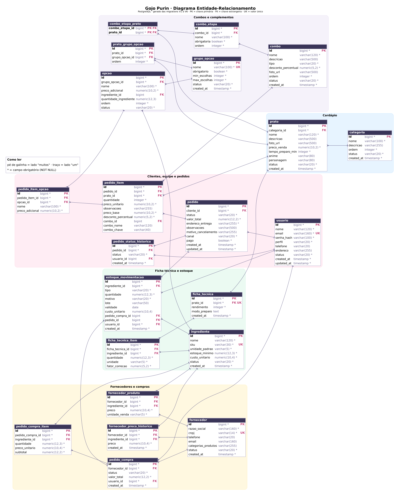

# Gojo Purin

Dark kitchen de comidas de anime: o restaurante que reproduz na vida real os pratos que aparecem nos animes.

Trabalho final de Desenvolvimento Full-Stack (UNASP SP, 2º semestre de 2026, prof. Thiago Silva), feito a partir do SRS **Comanda Digital v3.2**. O sistema tem duas partes:

- **Área do cliente:** cardápio público, carrinho, cadastro e login, checkout, acompanhamento do pedido e histórico.
- **Painel da equipe:** pedidos da cozinha, cardápio, fichas técnicas e custos, estoque, fornecedores e compras, dashboard e usuários internos.

## URLs de produção

| O quê | Onde |
|---|---|
| Site (front-end) | https://gojo-purin.vercel.app |
| API (back-end) | https://gojo-purin.onrender.com |
| Swagger | https://gojo-purin.onrender.com/swagger-ui.html |

O back-end está no plano gratuito do Render, que "hiberna" depois de um tempo sem uso. Se a primeira chamada demorar, espere cerca de um minuto e recarregue.

## Acesso para teste

| Perfil | Como entrar |
|---|---|
| ADMIN | `admin@email.com` / `senha123` (criado pelo seed do Flyway) |
| CLIENTE | Clique em "Criar conta" no site |
| GERENTE e COZINHEIRO | O admin cria em Painel → Usuários |

## Funcionalidades

Organizadas pelos blocos da seção 9.2 do SRS.

| # | Bloco | Requisitos | Onde ver |
|---|---|---|---|
| 1 | Cardápio público e carrinho | RF-001 a RF-003 | Página inicial, detalhe do prato, carrinho |
| 2 | Jornada do pedido do cliente | RF-004 a RF-008 | Cadastro, login, checkout, acompanhamento com linha do tempo, Meus pedidos |
| 3 | CRUD de cardápio | RF-009, RF-010, RF-014 | Painel → Cardápio e Categorias |
| 4 | Ficha técnica e custos | RF-011 a RF-013 | Painel → Cardápio → Ficha técnica (custo e food cost calculados no back, em tempo real) |
| 5 | Pedidos e cozinha | RF-015, RF-016, RF-019, RF-020 | Painel → Pedidos |
| 6 | Integração pedido-estoque | RF-017, RF-018 | Confirmar um pedido dá baixa no estoque; cancelar faz o estorno |
| 7 | Fornecedores e compras | RF-021 a RF-026 | Painel → Fornecedores, Catálogo, Cotação (com gráfico de preços) e Compras |
| 8 | Controle de estoque | RF-027 a RF-033 | Painel → Estoque, Ingredientes e Movimentações |
| 9 | Dashboard | RF-034 a RF-037 | Painel → Dashboard |
| 10 | Autenticação e RBAC | RF-038 a RF-043 | Login com JWT, 4 perfis, guards e interceptor; Painel → Usuários |

Extras do tema: combos (prontos e "monte o seu"), complementos por prato e ideogramas japoneses no lugar das fotos.

### Regras de negócio

| Regra | Onde está |
|---|---|
| RN01 Prato só fica ativo com ficha técnica | `PratoService` |
| RN02 Aviso quando o food cost passa de 35% | `FichaTecnicaService` |
| RN03 Sem estoque, sem pedido (422 com o que falta) | `EstoqueService`, chamado pelo `PedidoService` |
| RN04 Após EM_PREPARO, só gerente ou admin cancela | `AdminPedidoService` |
| RN05 Custo do ingrediente atualiza no recebimento da compra | `CompraService` |
| RN06 Exclusão lógica (status INATIVO ou CANCELADO) | Todos os services |
| RN07 CNPJ válido, inclusive o alfanumérico | `validation/CnpjValidator` |
| RN08 Fator de correção ≥ 1,0 | `FichaTecnicaItemRequest` (`@Min`) |
| RN09 Cardápio público só com pratos ativos | `CardapioService` e `PratoRepository` |
| RN10 E-mail único (409) | `AuthService` e `UsuarioService` |

## Stack

| Camada | Tecnologia | Onde roda |
|---|---|---|
| Front-end | Angular 22, Angular Material, Reactive Forms, Chart.js | Vercel |
| Back-end | Java 21, Spring Boot 3.5 (Web, Data JPA, Security, Validation), JWT, SpringDoc OpenAPI | Render (Docker) |
| Banco | PostgreSQL com migrations Flyway | Neon |

## Estrutura do repositório

```
gojo-purin/
├── backend/                        API Spring Boot
│   ├── Dockerfile                  imagem usada no Render
│   └── src/main/
│       ├── java/br/com/gojopurin/backend/
│       │   ├── config/             SecurityConfig, CorsConfig, JwtAuthFilter, OpenApiConfig
│       │   ├── controller/         endpoints REST (sem regra de negócio)
│       │   ├── service/            regras de negócio
│       │   ├── repository/         interfaces JPA e consultas
│       │   ├── model/              entidades (@Entity)
│       │   ├── dto/                requests e responses (a API nunca devolve uma entidade)
│       │   ├── exception/          GlobalExceptionHandler (@RestControllerAdvice)
│       │   └── validation/         validação de CNPJ
│       └── resources/
│           ├── application.properties
│           └── db/migration/       V1 a V6 (Flyway)
├── frontend/                       app Angular
│   └── src/
│       ├── environments/           URL da API (produção e desenvolvimento)
│       └── app/
│           ├── core/               serviços HTTP, guards, interceptor, modelos
│           ├── pages/              telas do cliente
│           └── pages/admin/        telas do painel
└── docs/                           DER (imagem e DBML)
```

## Como rodar localmente

### Pré-requisitos

- Java 21
- Node.js 22 ou mais novo
- PostgreSQL 15 ou mais novo, com um banco vazio chamado `gojopurin`

### 1. Back-end

Na pasta `backend`, defina as variáveis de ambiente e suba a API. No Windows (PowerShell):

```powershell
cd backend
$env:SPRING_DATASOURCE_PASSWORD = "senha-do-seu-postgres"
$env:JWT_SECRET = "uma-frase-longa-e-secreta-com-pelo-menos-32-caracteres"
.\mvnw.cmd spring-boot:run
```

No Linux ou macOS:

```bash
cd backend
export SPRING_DATASOURCE_PASSWORD=senha-do-seu-postgres
export JWT_SECRET=uma-frase-longa-e-secreta-com-pelo-menos-32-caracteres
./mvnw spring-boot:run
```

Na primeira vez, o Flyway cria todas as tabelas e o seed (admin, 8 categorias, 55 ingredientes, 25 pratos com ficha técnica, 4 fornecedores com catálogo e o estoque inicial). A API fica em `http://localhost:8080` e o Swagger em `http://localhost:8080/swagger-ui.html`.

### 2. Front-end

Em outro terminal, na pasta `frontend`:

```bash
cd frontend
npm install
npm start
```

O site abre em `http://localhost:4200` e conversa com a API local.

### Variáveis de ambiente do back-end

Nenhum segredo fica no código (RNF12): tudo vem destas variáveis.

| Variável | Para quê | Padrão local |
|---|---|---|
| `SPRING_DATASOURCE_URL` | Endereço JDBC do banco | `jdbc:postgresql://localhost:5432/gojopurin` |
| `SPRING_DATASOURCE_USERNAME` | Usuário do banco | `postgres` |
| `SPRING_DATASOURCE_PASSWORD` | Senha do banco | obrigatória |
| `JWT_SECRET` | Chave que assina os tokens | obrigatória |
| `CORS_ALLOWED_ORIGINS` | Endereços do front que podem chamar a API | `http://localhost:4200` |
| `PORT` | Porta da API | `8080` |

## Deploy

| Camada | Como está publicado |
|---|---|
| Banco | PostgreSQL gerenciado no Neon. As migrations rodam sozinhas quando a API sobe. |
| Back-end | Web Service no Render construído pelo `backend/Dockerfile`. As variáveis acima estão no painel do Render, com `SPRING_DATASOURCE_URL` apontando para o Neon e `CORS_ALLOWED_ORIGINS` para `https://gojo-purin.vercel.app`. |
| Front-end | Projeto na Vercel com a pasta `frontend` como raiz. O `vercel.json` manda todas as rotas para o `index.html`, para o Angular Router funcionar ao recarregar a página. |

Sobre os ambientes do Angular: o SRS cita `environment.prod.ts`. Este projeto segue o padrão do Angular atual, que faz a mesma coisa com outros nomes:

- `environment.ts` tem a URL de produção e é o usado no `ng build`;
- `environment.development.ts` tem `http://localhost:8080` e é o usado no `ng serve`.

## Banco de dados

O DER foi gerado a partir das tabelas que as migrations V1 a V6 criam, então mostra o banco real.



- `docs/der.png` e `docs/der.svg`: o diagrama em imagem.
- `docs/der.dbml`: o mesmo diagrama em DBML. Cole em [dbdiagram.io](https://dbdiagram.io) para editar ou exportar.

| Migration | O que faz |
|---|---|
| V1 | Tabela `categoria` |
| V2 | Todas as outras tabelas do SRS, com chaves, restrições e índices |
| V3 | Seed: admin, categorias, ingredientes, pratos com ficha técnica, fornecedores e estoque inicial |
| V4 | Combos, grupos de complementos e opções |
| V5 | Ajuste de nomes do domínio de combos |
| V6 | Combos e complementos dentro dos pedidos |

## Testando a API pelo Swagger

1. Abra o Swagger (link no topo).
2. Em `POST /api/auth/login`, clique em **Try it out** e envie:
   ```json
   { "email": "admin@email.com", "senha": "senha123" }
   ```
3. Copie o valor de `token` da resposta.
4. Clique em **Authorize** (cadeado no topo), cole o token e confirme.
5. Pronto: os endpoints de `/api/admin/...` passam a responder.

Endpoints públicos (sem token): `/api/auth/**` e `/api/cardapio/**`.

## Autoria

Joyce Gomes Silva · UNASP SP · Desenvolvimento Full-Stack · 2026
